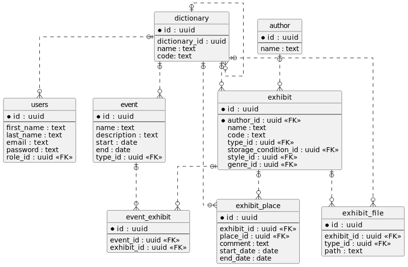

# gallery

## Навигация

- [Бизнес требования](#Бизнес-требования)
- [Архитектура приложения](#Архитектура-приложения)
- [Модель данных](#Модель-данных)
- [Точки доступа](#Точки-доступа)
  - [Адреса и порты](#Адреса-и-порты)
  - [Учетные записи](#Учетные-записи)
- [Как запустить](#Как-запустить)
  - [Запуск приложения](#Запуск-приложения)
  - [Frontend запросы](#Frontend-запросы)
  - [Подключение к БД](#Подключение-к-БД)
    - [Создание БД в Docker](#Создание-БД-в-Docker)
- [Backlog](#Backlog)

## Бизнес требования
Приложение выполняет следующие бизнес-функции:
- сайт:
  - просмотр мероприятий;
  - рекомендация мероприятий;
- панель администратора:
  - авторизация и аутентификация;
  - CRU экспонатов;
  - CRD документов;
  - загрузка и выгрузка документов экспонатов;
  - перемещения экспонатов;
  - CRU авторов;
  - СRU мероприятий;
  - CD экпонатов в мероприятие;

## Архитектура приложения

Приложение написано с использованием Spring-Boot фреймворка.

В качестве сборщика проекта выбран Maven.

В качестве базы данных используется PostgreSQl.

Мультимодульный проект:

| Модуль                       | Обязанность                                                                                                                                                                                   |                  
|:-----------------------------|:----------------------------------------------------------------------------------------------------------------------------------------------------------------------------------------------|
| application                  | Запуск приложения. Содержит конфигурацию всего проекта.                                                                                                                                       |
| migration                    | Миграция стуктуры и данных в СУБД. Миграция данных выполняется средствами Liquibase.                                                                                                          |
| model                        | Обработка бизнес логики. Взаимодейстие с СУБД. Содержит pojo модель (Entity) и реализацию взаимодейстивя с СУБД. Слой доступа к БД.                                                           |
| datatables-pagination-api    | Реализация api для взаимодействия с фрейморком tadatables.                                                                                                                                    |
| security                     | Аутентификация и авторизация. Может быть применена к любому слою для обеспечения безопасности.                                                                                                |
| web-api                      | Предоставление API. Слой отвечает за принятие REST запросов от клиента.                                                                                                                       |
| web-ui                       | Отображение web страниц панели администратора и сайта. Состоит из статических HTML файлов и клиентской логики с использованием Java Script. В качестве web-сервера выступает само приложение. |
| datatables-pagination-plugin | Интерфейс api для взаимодействия с фрейморком tadatables.                                                                                                                                     |

## Модель данных

## Точки доступа

### Адреса и порты
| Функция                                            | Адрес                |                  
|:---------------------------------------------------|:---------------------|
| Точка доступа к приложению - сайт                  | localhost:8080       |
| Точка доступа к приложению - панель администратора | localhost:8080/admin |

### Учетные записи

| Почта             | Пароль   | Примечание                                    | Роль  |                  
|:------------------|:---------|:----------------------------------------------|:------|
| admin@mail.ru     | password | Пользователь для входа в панель администратор | ADMIN |

## Как запустить

### Запуск приложения

Для сборки и запуска приложения вам понадобиться:
- JDK 11
- Maven

Запустить цикл **install** в модуле **application**.
В результате получим исполняемый **jar** файл в директории **target**.

### Frontend запросы

swagger ui доступен по ресурсу - /swagger-ui.html

openapi спецификация доступна по ресурсу - /api-docs

### Подключение к БД

Переменные окружения для подключения к БД:
- SPRING_DATASOURCE_URL
- SPRING_DATASOURCE_USERNAME
- SPRING_DATASOURCE_PASSWORD
- SPRING_DATASOURCE_DRIVER

Параметры подключения по умолчанию:
- url: jdbc:postgresql://localhost:5432/postgres
- driverClassName: org.postgresql.Driver
- username: postgres
- password: postgres1

#### Создание БД в Docker
1. Загрузка image БД PostgreSQL`docker pull postgres`
2. Запуск контейнера `docker run --rm --name=myContainer --env="POSTGRES_PASSWORD=postgres1" --publish 5432:5432 -d postgres`
3. Для дополнительного доступа к СУБД (для создания бд/схемы):
   1. Вызов контейнера `docker exec -it myContainer bash`
   2. Переключение на пользователя `su postgres`
   3. Вызов консоли `psql`

## Backlog
важно!
- исправление вызгрузки документов
- изображения понизить размер фото - оптимизация
- актуализировать ридми
- добавить тесты на ендпоинты
- добавить мягкое удаление (soft delete)
- добавить аудит: created_at, created_by, updated_at, updated_by
- логгировать RUD операции
- добавить тесты на дб (возможно в контейнере)
- поднятие проекта полностью в докере (и бада и приложение в бд через docker compose)
- подключить sonar
- проверить ошибки в консоли браузера и сети браузера
- выгрузка отчетов
